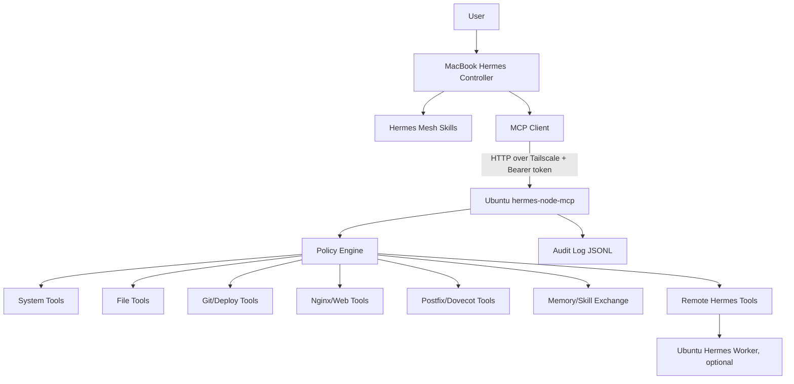

# hermes-mesh

[한국어](README.ko.md) · [Language landing](README.md)

> A private agent mesh for safe Hermes-to-machine and Hermes-to-Hermes operations over Tailscale, MCP, policy enforcement, backups, and audit logs.

`hermes-mesh` started from a practical question:

> Can the Hermes running on a MacBook safely operate an Ubuntu homepage/mail server, and later coordinate with other Hermes instances by sharing memory and skills?

The first target is simple:

```text
Hermes on MacBook M3 Max
  -> Tailscale private network
  -> MCP node on Ubuntu homepage/mail server
  -> safely operate nginx, postfix, dovecot, and website repos
```

## Why this exists

Giving an AI agent unrestricted SSH/root access is convenient but unsafe. Locking everything down too much makes the agent useless.

`hermes-mesh` aims for the middle ground:

- agents call typed MCP tools instead of raw unrestricted shell;
- remote nodes enforce policy locally;
- file writes create backups and return diffs;
- risky actions require confirmation;
- every remote action is audited;
- transport stays inside a Tailscale private mesh;
- useful memories are shared with explicit source/provenance;
- skills are shared as user-confirmed versioned packages.

## Core idea

```text
MacBook Hermes = controller / planner / reviewer
Ubuntu MCP node = safe actuator
Ubuntu Hermes = optional local worker
Tailscale = private transport
MCP = tool protocol
Skill = operating manual / policy / workflow
Audit log = accountability
Git = source-of-truth for website/code changes
Boradori/Obsidian = durable knowledge layer
Discord/Telegram = coordination surface
```

## Architecture



## First real target

```yaml
node:
  id: ubuntu-mail
  host: mail.tailb30d36.ts.net
  tailscale_ip: 100.89.252.12
  roles:
    - webserver
    - mailserver
    - deploy-target
services:
  - nginx
  - postfix
  - dovecot
  - certbot
```

## Planned capabilities

### 1. Machine and service diagnostics

```text
system_info()
disk_usage()
memory_usage()
port_list()
service_status(service)
recent_logs(unit, lines)
```

### 2. Safe command execution

```text
run_command(command, cwd?, timeout?)
```

This is not unrestricted shell. The node policy decides what command prefixes and working directories are allowed.

Examples:

- allowed: `git status`, `nginx -t`, `systemctl status nginx`, `mailq`
- denied: `rm -rf /`, `mkfs`, `dd`, `userdel`, raw firewall mutation, `curl | bash`

### 3. Safe file operations

```text
list_dir(path)
read_file(path)
write_file_with_backup(path, content)
patch_file(path, old, new)
```

Writes follow this sequence:

```text
policy check
-> backup existing file
-> write temp file
-> validate
-> atomic replace
-> return diff
-> write audit log
```

### 4. Homepage deployment

```text
homepage_status()
homepage_diff()
deploy_homepage(plan_only=true)
deploy_homepage(apply=true, plan_id=...)
rollback_homepage(backup_id)
nginx_test()
nginx_reload()
```

Target flow:

```text
check repo status
-> edit files
-> show diff
-> build/test
-> nginx -t
-> nginx reload
-> health check
-> report result and audit id
```

### 5. Mail server diagnostics

Initial mode should be read-only first:

```text
mail_services_status()
mail_queue()
mail_recent_errors(lines=200)
mail_tls_status()
mail_dns_check(domain)
postfix_reload()
dovecot_reload()
```

High-risk actions require confirmation:

- account creation/deletion
- mailbox deletion
- postfix/dovecot config edits
- DNS/SPF/DKIM/DMARC changes
- package upgrades
- service restarts

### 6. Hermes-to-Hermes delegation

A future Ubuntu Hermes can act as a local worker:

```text
remote_hermes_chat(prompt, profile?, timeout?)
remote_hermes_job_start(prompt, profile?)
remote_hermes_job_status(job_id)
remote_hermes_job_result(job_id)
remote_hermes_job_cancel(job_id)
```

Default policy:

```text
remote Hermes performs read-only analysis by default
risky changes are reviewed by controller Hermes
final application goes through policy-bound MCP tools
```

### 7. Shared memory and skill exchange

The long-term goal is automatic but controlled knowledge sharing between Hermes instances.

Principle:

```text
Automatic propose, explicit provenance, user-approved promotion.
```

Memory is shared as source-attributed cards:

```yaml
kind: memory_card
subject: ubuntu-mail-node
title: Ubuntu mail node is reachable over Tailscale
source:
  node_id: macbook-controller
  agent: hermes
  method: tailscale_status
  observed_at: "2026-05-10T15:30:00+09:00"
confidence: high
sensitivity: low
promotion:
  state: proposed
```

Skills are shared as versioned packages with diffs and confirmation:

```yaml
kind: skill_package
name: ubuntu-mail-homepage-admin
version: 0.1.1
action: update
requires_user_confirmation: true
status: proposed
```

## Discord multi-agent comparison

Discord multi-agent rooms are useful as a coordination plane:

```text
Hermes = coordinator
OpenClaw/Codex = implementer
Claude/Opus = reviewer
Human = final direction
```

But Discord should not be the execution boundary. `hermes-mesh` is the execution plane:

```text
Discord council proposes
Reviewer reviews
Hermes controller applies
MCP node enforces policy
Audit log records action
```

## Security principles

Never:

- run the MCP node as root;
- expose the endpoint to the public internet;
- provide unrestricted `run_command`;
- grant `sudo ALL=(root) NOPASSWD: ALL`;
- commit real tokens/private keys;
- allow reads of `/etc/shadow`, `/root`, TLS private keys, or SSH private keys.

Always:

- use Tailscale-only access;
- require Bearer token auth;
- enforce path allowlists/denylists;
- enforce command allowlists/denylists;
- create backups and diffs before writes;
- keep audit logs;
- require approval for dangerous actions;
- prefer sudo wrapper scripts.

## MVP roadmap

### MVP 0. Design, docs, scaffold

Current state.

- architecture doc
- threat model
- MCP tool spec
- shared memory/skill exchange design
- example node config
- Hermes skill drafts
- Python package skeleton

### MVP 1. Ubuntu Remote MCP Node

Goal:

```text
MacBook Hermes can call system/service info tools on the Ubuntu node over Tailscale MCP.
```

Required tools:

```text
system_info()
disk_usage()
service_status(service)
recent_logs(unit, lines)
run_command() with tiny allowlist
```

### MVP 2. File/Git tools

- read/list/write-with-backup
- patch with unique match
- git status/diff
- homepage repo status

### MVP 3. Homepage deploy

- deploy plan/apply
- build/test
- nginx -t
- reload
- health check
- rollback

### MVP 4. Mail server diagnostics

- postfix/dovecot/fail2ban status
- mail queue
- recent error summary
- TLS certificate check
- DNS record check

### MVP 5. Remote Hermes worker

- remote Hermes one-shot chat
- long-running job start/status/result/cancel
- controller-side verification

### MVP 6. Shared memory and skill registry

- memory card schema
- skill package schema
- proposal/approval/rejection workflow
- sync approved memory cards
- user-confirmed skill install

## Repository structure

```text
hermes-mesh/
  README.md                 # language landing page
  README.ko.md              # Korean overview
  README.en.md              # English overview
  docs/
    architecture.md
    threat-model.md
    mvp.md
    mcp-tools.md
    shared-memory-and-skills.md
  configs/
    node.example.yaml
    hermes-config.example.yaml
  skills/
    hermes-mesh-control/SKILL.md
    ubuntu-mail-homepage-admin/SKILL.md
    remote-hermes-delegation/SKILL.md
  systemd/
    hermes-node-mcp.service
  scripts/
    smoke-test.sh
  src/hermes_mesh/
    server.py
    config.py
    policy.py
    audit.py
    tools/
```

## MacBook Hermes config example

Add this to `~/.hermes/config.yaml` after the Ubuntu node is running:

```yaml
mcp_servers:
  ubuntu_mail:
    url: "http://mail.tailb30d36.ts.net:8732/mcp"
    headers:
      Authorization: "Bearer ${HERMES_NODE_TOKEN_MAIL}"
    timeout: 180
    connect_timeout: 30
```

Keep the real token in `~/.hermes/.env`:

```bash
HERMES_NODE_TOKEN_MAIL="long-random-token"
```

## Reading order

1. `README.md` — language landing page
2. `README.ko.md` or `README.en.md` — overview
3. `docs/architecture.md` — system architecture
4. `docs/threat-model.md` — security model
5. `docs/mvp.md` — implementation roadmap
6. `docs/mcp-tools.md` — MCP tool specification
7. `docs/shared-memory-and-skills.md` — shared memory and skill exchange
8. `configs/node.example.yaml` — example Ubuntu node config
9. `skills/*/SKILL.md` — draft Hermes skills

## Current status

The repository is currently a design pack plus implementation skeleton. The next implementation target is:

```text
MacBook Hermes can call system_info() on the Ubuntu mail node over Tailscale MCP.
```

## License

MIT
