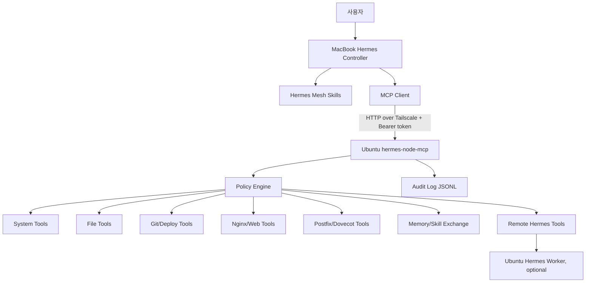

# hermes-mesh

[English](README.en.md) · [언어 선택 화면](README.md)

> Tailscale + MCP + 정책 엔진 + 감사 로그를 이용해, 한 Hermes가 다른 머신 또는 다른 Hermes를 안전하게 다룰 수 있게 만드는 개인 AI 운영망 프로젝트.

`hermes-mesh`는 “내 맥북의 Hermes가 내 우분투 홈페이지/메일서버를 자유롭게 핸들링하고, 나중에는 Hermes끼리도 작업을 위임하게 만들 수 없을까?”라는 아이디어에서 시작한 프로젝트입니다.

첫 목표는 단순합니다.

```text
MacBook M3 Max의 Hermes
  → Tailscale private network
  → Ubuntu mail/homepage 서버의 MCP node
  → nginx, postfix, dovecot, 홈페이지 repo를 안전하게 조작
```

## 왜 필요한가

AI agent에게 서버를 맡기려면 보통 두 가지 사이에서 갈등이 생깁니다.

1. SSH/root를 많이 열어주면 편하지만 위험합니다.
2. 권한을 너무 막으면 agent가 실제 작업을 거의 못 합니다.

`hermes-mesh`는 그 중간 지대를 목표로 합니다.

- agent는 typed MCP tools를 호출합니다.
- remote node는 policy를 강제합니다.
- 파일 수정은 backup/diff를 남깁니다.
- 위험 작업은 승인 후 실행합니다.
- 모든 remote action은 audit log에 남깁니다.
- 네트워크는 Tailscale private mesh 위에서만 열립니다.

## 핵심 아이디어

```text
MacBook Hermes = controller / planner / reviewer
Ubuntu MCP node = safe actuator
Ubuntu Hermes = optional local worker
Tailscale = private transport
MCP = tool protocol
Skill = operating manual / policy / workflow
Memory card = source-attributed shared memory
Skill package = user-confirmed shared skill update
Audit log = accountability
Git = homepage change history
Discord/Telegram = coordination surface
Boradori/Obsidian = durable knowledge layer
```

## 전체 구조



## 첫 번째 실제 대상

현재 1차 target은 개인 Ubuntu 서버입니다.

```yaml
node:
  id: ubuntu-mail
  host: mail.tailb30d36.ts.net
  tailscale_ip: 100.89.252.12
  roles:
    - webserver
    - mailserver
    - deploy-target
services:
  - nginx
  - postfix
  - dovecot
  - certbot
```

## 제공하려는 기능

### 1. 서버 상태 확인

- hostname, uptime, OS/kernel
- disk/memory
- listening ports
- process summary
- service status

예상 tool:

```text
system_info()
disk_usage()
memory_usage()
port_list()
service_status(service)
recent_logs(unit, lines)
```

### 2. 안전한 명령 실행

무제한 shell이 아니라 allowlist 기반 command runner를 제공합니다.

```text
run_command(command, cwd?, timeout?)
```

정책 예시:

- 허용: `git status`, `nginx -t`, `systemctl status nginx`, `mailq`
- 금지: `rm -rf /`, `mkfs`, `dd`, `userdel`, raw firewall mutation, `curl | bash`

### 3. 안전한 파일 작업

```text
list_dir(path)
read_file(path)
write_file_with_backup(path, content)
patch_file(path, old, new)
```

파일 쓰기는 반드시 다음 흐름을 따릅니다.

```text
정책 확인
→ 기존 파일 백업
→ 임시 파일 작성
→ validation
→ atomic replace
→ diff 반환
→ audit log 기록
```

### 4. 홈페이지 배포

```text
homepage_status()
homepage_diff()
deploy_homepage(plan_only=true)
deploy_homepage(apply=true, plan_id=...)
rollback_homepage(backup_id)
nginx_test()
nginx_reload()
```

목표는 Hermes가 “홈페이지 문구 바꿔줘” 같은 요청을 받았을 때 다음을 안전하게 수행하는 것입니다.

```text
repo 상태 확인
→ 파일 수정
→ diff 표시
→ build/test
→ nginx -t
→ nginx reload
→ health check
→ 결과 보고
```

### 5. 메일서버 진단

초기에는 read-only 중심입니다.

```text
mail_services_status()
mail_queue()
mail_recent_errors(lines=200)
mail_tls_status()
mail_dns_check(domain)
postfix_reload()
dovecot_reload()
```

메일서버 관련 위험 작업은 기본적으로 승인 필요입니다.

- 계정 생성/삭제
- mailbox 삭제
- postfix/dovecot config 수정
- DNS/SPF/DKIM/DMARC 변경
- package upgrade
- service restart

### 6. Hermes-to-Hermes delegation

나중에는 Ubuntu에도 Hermes를 설치하고, MacBook Hermes가 Ubuntu Hermes에게 작업을 위임할 수 있게 합니다.

```text
remote_hermes_chat(prompt, profile?, timeout?)
remote_hermes_job_start(prompt, profile?)
remote_hermes_job_status(job_id)
remote_hermes_job_result(job_id)
remote_hermes_job_cancel(job_id)
```

기본 정책:

```text
remote Hermes는 read-only 분석 우선
위험한 변경은 controller Hermes가 검토
최종 적용은 policy-bound MCP tool을 통해 수행
```

### 7. Hermes 간 기억/스킬 공유

궁극적 목표는 여러 Hermes가 각자 배운 것을 안전하게 공유하는 것입니다.

핵심 원칙:

```text
Automatic propose, explicit provenance, user-approved promotion.
```

즉:

```text
자동으로 제안하고,
반드시 출처를 남기고,
공유/승격은 정책 또는 사용자 승인으로 한다.
```

기억은 raw memory dump가 아니라 출처가 달린 `memory_card`로 공유합니다.

```yaml
kind: memory_card
subject: ubuntu-mail-node
title: Ubuntu mail node is reachable over Tailscale
source:
  node_id: macbook-controller
  agent: hermes
  method: tailscale_status
  observed_at: "2026-05-10T15:30:00+09:00"
confidence: high
sensitivity: low
promotion:
  state: proposed
```

스킬은 diff와 이유가 있는 `skill_package`로 제안하고, 설치/동기화는 레리삐 확인 후 진행합니다.

```yaml
kind: skill_package
name: ubuntu-mail-homepage-admin
version: 0.1.1
action: update
requires_user_confirmation: true
status: proposed
```

### 8. Discord multi-agent council과의 관계

Discord/Telegram은 여러 에이전트가 토론하고 역할을 나누는 coordination plane으로 둡니다.

```text
Discord council proposes
Reviewer reviews
Hermes controller applies
MCP node enforces policy
Audit log records action
```

즉, Discord는 회의실이고 `hermes-mesh`는 실제 실행/기억/스킬 공유 계층입니다.

## 보안 원칙

절대 하지 않을 것:

- MCP node를 root로 실행
- public internet에 endpoint 노출
- unrestricted `run_command` 제공
- `sudo ALL=(root) NOPASSWD: ALL` 제공
- 실제 token/private key를 repo에 commit
- `/etc/shadow`, `/root`, TLS private key, SSH private key 읽기 허용

반드시 할 것:

- Tailscale network에서만 접근
- Bearer token 인증
- path allowlist/denylist
- command allowlist/denylist
- write backup/diff
- audit log
- dangerous action approval
- sudo wrapper script 사용

## MVP 로드맵

### MVP 0. 설계/문서/스캐폴드

현재 상태입니다.

- architecture doc
- threat model
- MCP tool spec
- example node config
- Hermes skill drafts
- Python package skeleton

### MVP 1. Ubuntu Remote MCP Node

목표:

```text
MacBook Hermes가 Tailscale을 통해 Ubuntu MCP node의 system/service info tool을 호출한다.
```

필수 tool:

```text
system_info()
disk_usage()
service_status(service)
recent_logs(unit, lines)
run_command() with tiny allowlist
```

### MVP 2. File/Git Tools

- read/list/write-with-backup
- patch with unique match
- git status/diff
- homepage repo 상태 확인

### MVP 3. Homepage Deploy

- deploy plan/apply
- build/test
- nginx -t
- reload
- health check
- rollback

### MVP 4. Mailserver Diagnostics

- postfix/dovecot/fail2ban status
- mail queue
- recent error summary
- TLS certificate check
- DNS record check

### MVP 5. Remote Hermes Worker

- remote Hermes one-shot chat
- long-running job start/status/result/cancel
- controller-side verification

### MVP 6. Shared Memory and Skill Registry

- `memory_card` schema
- `skill_package` schema
- proposal/approval/rejection workflow
- approved memory sync
- user-confirmed skill install/sync

## 레포 구조

```text
hermes-mesh/
  README.md                 # 언어 선택 첫 화면
  README.ko.md              # 한국어 개요
  README.en.md              # 영어 개요
  docs/
    architecture.md
    threat-model.md
    mvp.md
    mcp-tools.md
    shared-memory-and-skills.md
    daemon-sync.md
  configs/
    node.example.yaml
    hermes-config.example.yaml
  skills/
    hermes-mesh-control/SKILL.md
    ubuntu-mail-homepage-admin/SKILL.md
    remote-hermes-delegation/SKILL.md
  systemd/
    hermes-node-mcp.service
  scripts/
    smoke-test.sh
  src/hermes_mesh/
    server.py
    config.py
    policy.py
    audit.py
    tools/
```

## MacBook Hermes 설정 예시

MacBook의 `~/.hermes/config.yaml`에 다음 형태로 MCP server를 추가합니다.

```yaml
mcp_servers:
  ubuntu_mail:
    url: "http://mail.tailb30d36.ts.net:8732/mcp"
    headers:
      Authorization: "Bearer ${HERMES_NODE_TOKEN_MAIL}"
    timeout: 180
    connect_timeout: 30
```

실제 token은 `~/.hermes/.env`에 둡니다.

```bash
HERMES_NODE_TOKEN_MAIL="긴랜덤토큰"
```

## 읽는 순서

1. `README.ko.md` — 한국어 개요
2. `docs/architecture.md` — 전체 구조
3. `docs/threat-model.md` — 보안 모델
4. `docs/mvp.md` — 단계별 구현 계획
5. `docs/mcp-tools.md` — MCP tool specification
6. `docs/shared-memory-and-skills.md` — Hermes 간 기억/스킬 공유 설계
7. `configs/node.example.yaml` — Ubuntu node config 예시
8. `skills/*/SKILL.md` — Hermes skill 초안

## 현재 상태

현재 첫 구현 slice가 들어갔습니다.

```text
구현됨:
- source/provenance 필수 `MemoryCard` schema
- stable `mem_<sha256>` ID
- local file-backed memory registry
- propose/list/approve/reject CLI
- daemon HTTP API for node-to-node sync
- `/memory/sync/push` approved_shared fan-out endpoint
- decisions.jsonl 감사 로그
```

사용 예:

```bash
uv run --extra dev hermes-mesh memory propose --file card.json
uv run --extra dev hermes-mesh memory list --state proposed
uv run --extra dev hermes-mesh memory approve mem_xxxxx --actor lerippi
uv run hermes-mesh-daemon --host 127.0.0.1 --port 8732 --node-id macbook-controller --token dev-token
```

다음 구현 목표는 다음 한 줄입니다.

```text
MacBook Hermes can call system_info() on Ubuntu mail node over Tailscale MCP.
```

## 라이선스

MIT
