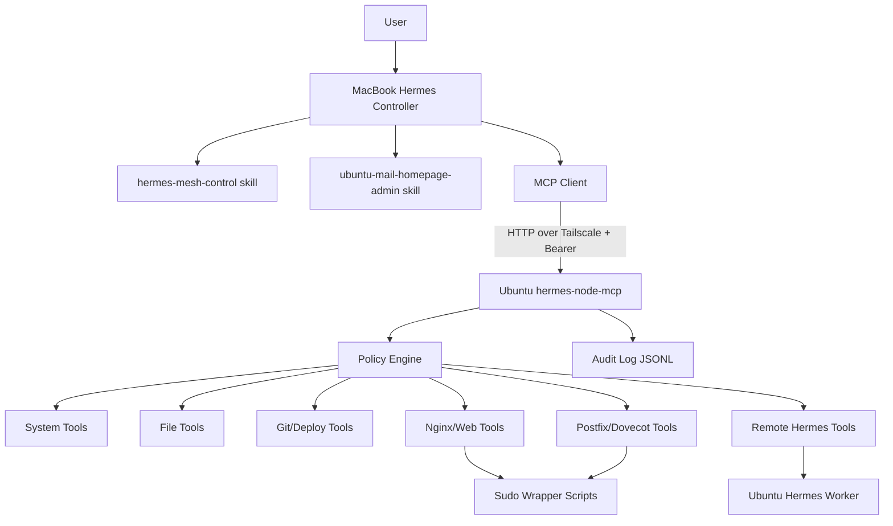
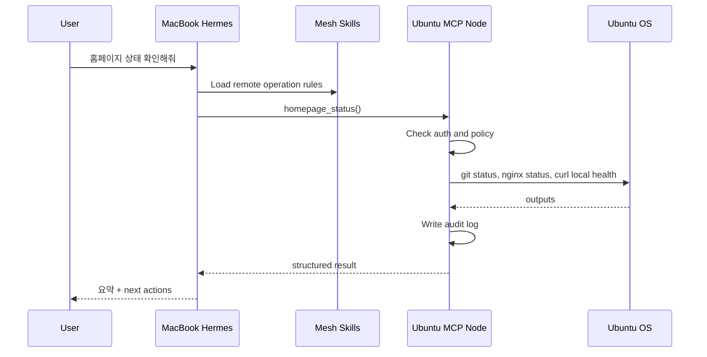

# Hermes Mesh Architecture

## Goal

Allow Hermes instances and Hermes-compatible machine nodes to communicate over a private network, so one Hermes can safely inspect, operate, and delegate work to another machine.

The first concrete use case is:

```text
MacBook Hermes controls Ubuntu mail/homepage server over Tailscale.
```

## Layers

```text
Interaction Layer
  - User asks local Hermes for remote server work
  - Telegram/Discord/CLI can later become entry points

Controller Layer
  - MacBook Hermes plans, reviews, and coordinates
  - Loads skills that encode remote-operation policy

Transport Layer
  - Tailscale private network
  - Optional Tailscale ACLs
  - HTTP MCP endpoint bound to Tailscale IP/DNS only

Tool Layer
  - Remote MCP server exposes typed tools
  - Tools are policy-bound and audited

Execution Layer
  - Ubuntu local shell commands
  - sudo wrapper scripts for restricted privileged actions
  - Git deploy scripts
  - service status/reload scripts

Delegation Layer, optional
  - Remote Hermes can be invoked for local analysis or long-running jobs
  - Controller Hermes remains final reviewer for risky changes
```

## Component diagram



## Request flow



## Responsibility split

| Component | Responsibility | Should not do |
| --- | --- | --- |
| MacBook Hermes | plan, decide, review, ask approval | hold server root keys unrestricted |
| Mesh skill | operational policy and workflows | store secrets |
| MCP node | expose safe typed tools | make autonomous high-risk decisions |
| Policy engine | allow/deny paths/commands/services | trust model output blindly |
| Sudo wrappers | narrow privileged actions | expose `sudo ALL` |
| Audit log | record remote actions | store secret arguments verbatim |
| Remote Hermes | optional local reasoning | bypass controller approval |

## Recommended node roles

```yaml
roles:
  - controller
  - desktop
  - webserver
  - mailserver
  - deploy-target
  - gpu-worker
  - nas
  - knowledge-base
```

## First production target

```yaml
node:
  id: ubuntu-mail
  host: mail.tailb30d36.ts.net
  tailscale_ip: 100.89.252.12
  roles: [webserver, mailserver, deploy-target]
services:
  - nginx
  - postfix
  - dovecot
  - certbot
```
