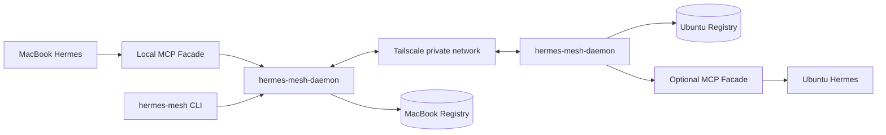

# Daemon-to-Daemon Memory Sync

Hermes Mesh uses MCP as the agent-facing control plane, but uses always-on daemons for automatic memory exchange.

## Why daemon first

MCP is excellent when Hermes or another agent actively asks for a tool call:

```text
list pending memories
approve this memory
show peer status
trigger sync now
```

Automatic memory sharing needs a long-lived runtime:

```text
heartbeat peers
accept inbound memory proposals
push approved memories
retry when a peer is offline
deduplicate cards
preserve source/provenance
write audit logs
```

So the recommended split is:

```text
MCP = agent-facing control surface
Daemon = background sync runtime
CLI = human/debug/admin surface
Registry = source-attributed truth store
```

## Component layout



## Current MVP implementation

Implemented files:

```text
src/hermes_mesh/daemon.py
  - Starlette HTTP API
  - bearer-token auth for protected endpoints
  - public /health and /node
  - /memory/propose
  - /memory/cards
  - /memory/cards/{id}
  - /memory/cards/{id}/approve
  - /memory/cards/{id}/reject
  - /memory/sync/push
  - /memory/sync/pull
  - /memory/sync/run-once

src/hermes_mesh/sync.py
  - MemorySyncClient
  - sync_approved_to_peer
  - dependency-free urllib JSON transport
```

The daemon reuses the existing source-attributed registry:

```text
src/hermes_mesh/memory.py
src/hermes_mesh/registry.py
```

## API

Public endpoints:

```text
GET /health
GET /node
```

Protected endpoints require:

```text
Authorization: Bearer <token>
```

Memory endpoints:

```text
POST /memory/propose
GET  /memory/cards?state=proposed
GET  /memory/cards/{id}
POST /memory/cards/{id}/approve
POST /memory/cards/{id}/reject
GET  /memory/sync/pull
POST /memory/sync/push
POST /memory/sync/run-once
```

## Source preservation rule

All inbound memories must validate as `MemoryCard`.

This means a daemon rejects anonymous memories. The minimum required provenance is:

```json
{
  "source": {
    "node_id": "ubuntu-mail",
    "agent": "hermes-mesh-daemon",
    "method": "system_probe",
    "observed_at": "2026-05-10T15:30:00+09:00"
  }
}
```

Imported cards keep their original `source`. They must not be rewritten as if the receiving node directly observed the fact.

## Start with config

MacBook example:

```bash
mkdir -p ~/.hermes-mesh
cp configs/macbook.example.yaml ~/.hermes-mesh/macbook.yaml
export HERMES_MESH_TOKEN=local-controller-token
export HERMES_MESH_TOKEN_UBUNTU_MAIL=peer-token
uv run hermes-mesh-daemon --config ~/.hermes-mesh/macbook.yaml
```

Ubuntu example:

```bash
sudo mkdir -p /etc/hermes-mesh /var/lib/hermes-mesh
sudo cp configs/node.example.yaml /etc/hermes-mesh/node.yaml
sudo install -m 600 /dev/null /etc/hermes-mesh/hermes-daemon.env
# add HERMES_MESH_TOKEN and HERMES_MESH_TOKEN_MACBOOK to hermes-daemon.env
uv run hermes-mesh-daemon --config /etc/hermes-mesh/node.yaml
```

## Start locally

Development:

```bash
uv run hermes-mesh-daemon \
  --host 127.0.0.1 \
  --port 8732 \
  --node-id macbook-controller \
  --role controller \
  --token dev-token \
  --registry /tmp/hermes-mesh-registry
```

Health check:

```bash
curl http://127.0.0.1:8732/health
curl http://127.0.0.1:8732/node
```

Propose a memory:

```bash
curl -sS -X POST http://127.0.0.1:8732/memory/propose \
  -H "Authorization: Bearer $HERMES_MESH_TOKEN" \
  -H 'Content-Type: application/json' \
  --data @card.json
```

List pending memories:

```bash
curl -sS 'http://127.0.0.1:8732/memory/cards?state=proposed' \
  -H "Authorization: Bearer $HERMES_MESH_TOKEN"
```

Trigger one sync pass now:

```bash
curl -sS -X POST http://127.0.0.1:8732/memory/sync/run-once \
  -H "Authorization: Bearer $HERMES_MESH_TOKEN"
```

## Current sync behavior

`/memory/sync/push` accepts only `approved_shared` cards.

`/memory/sync/run-once` invokes the same heartbeat + push + pull loop used by periodic sync. It returns peer results, reports bad peers as structured `ok: false` entries, and returns `{"peers": []}` when no peers are configured.

This prevents arbitrary worker nodes from silently installing proposed memories as shared truth.

```text
worker nodes may propose
controller approves
only approved_shared cards fan out
```

## Next implementation steps

1. Add config-backed peer definitions. ✅
2. Add periodic heartbeat loop. ✅
3. Add periodic push/pull loop. ✅
4. Add MCP facade tools that call local daemon API. ✅
5. Add launchd/systemd installation helpers. ✅
6. Run real MacBook ↔ Ubuntu deployment smoke.
7. Add conflict handling and imported-from metadata.
8. Add user notification when new proposals arrive.
