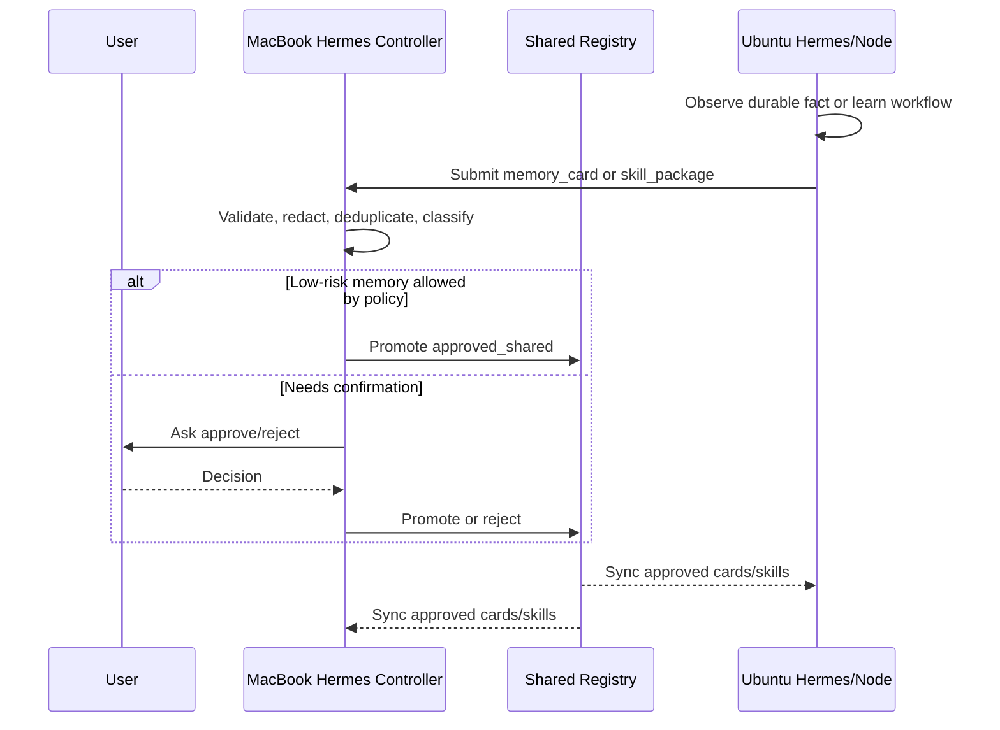

# Shared Memory and Skill Exchange

## Goal

The long-term goal of Hermes Mesh is not only remote machine control. It should become a trusted coordination layer where multiple Hermes instances can share useful memory and skills across machines while preserving provenance, user control, and safety.

In Lerippi's target model:

```text
MacBook Hermes
Ubuntu Hermes
future NAS/GPU/desktop Hermes nodes
Discord/Telegram entry points
Boradori/Obsidian knowledge base
```

should be able to cooperate by:

1. automatically proposing memory sharing,
2. clearly naming the source of each memory,
3. automatically exchanging low-risk operational observations,
4. requiring user confirmation before shared skills become active,
5. keeping raw private memory local unless explicitly approved.

## Core principle

```text
Automatic propose, explicit provenance, user-approved promotion.
```

Hermes instances may discover and propose useful memory/skill updates automatically, but promotion into canonical shared memory or installed shared skills should be controlled.

## Planes

```text
Local Memory Plane
  - each Hermes instance keeps its own private memory
  - raw memory is not dumped to other agents by default

Shared Memory Proposal Plane
  - nodes publish small, source-attributed memory cards
  - cards are reviewable, deduplicated, and scored

Canonical Shared Memory Plane
  - user-approved or policy-approved memories
  - source and confidence preserved
  - syncable across Hermes nodes

Skill Proposal Plane
  - nodes propose new or updated skills
  - diffs, tests, and provenance are included

Skill Registry Plane
  - approved skills are installed/synced
  - versioned, signed/checksummed, and rollbackable
```

## Memory card schema

A memory shared between Hermes nodes should not be a vague sentence. It should be a structured card.

```yaml
id: mem_20260510_abc123
kind: memory_card
subject: ubuntu-mail-node
title: Ubuntu mail node is reachable over Tailscale
content: >
  The Ubuntu homepage/mailserver appears as Tailscale host
  mail.tailb30d36.ts.net with IPv4 100.89.252.12.
source:
  node_id: macbook-controller
  agent: hermes
  method: tailscale_status
  observed_at: "2026-05-10T15:30:00+09:00"
  evidence:
    - type: command
      command: tailscale status --json
      redacted: true
confidence: high
scope:
  visibility: shared
  allowed_nodes:
    - macbook-controller
    - ubuntu-mail
sensitivity: low
promotion:
  state: proposed
  requires_user_confirmation: false
links:
  repo: https://github.com/misolove/hermes-mesh
```

## Memory promotion states

```text
local_only
  Raw local memory. Never shared automatically.

proposed
  A node thinks this memory may be useful to others.

shared_candidate
  Deduplicated and normalized, waiting for approval or policy.

approved_shared
  Canonical shared memory. Can sync to other nodes.

rejected
  Not shared. Retain rejection reason to avoid repeated proposals.

expired
  Time-bound memory is no longer current.
```

## Provenance requirements

Every shared memory must include:

- source node
- source agent/runtime
- observation method
- timestamp
- evidence pointer or redacted evidence summary
- confidence
- sensitivity level
- promotion state

Good:

```text
source: macbook-controller / hermes / tailscale_status / 2026-05-10
confidence: high
```

Bad:

```text
source: unknown
content: I remember the server is mail.
```

## Sensitivity levels

```yaml
sensitivity:
  public: safe for public docs
  low: safe across Lerippi's trusted nodes
  internal: shared only between approved private nodes
  secret: never shared as memory content; store only redacted pointer
  dangerous: requires explicit confirmation and maybe manual handling
```

Examples:

| Memory | Sensitivity | Default |
| --- | --- | --- |
| repo URL | public | share allowed |
| Tailscale hostname | low/internal | share allowed among trusted nodes |
| service topology | internal | propose |
| API token | secret | never share raw |
| SSH private key path | secret | never share raw |
| mailbox contents | dangerous | never auto-share |

## Shared memory workflows

### 1. Automatic low-risk sharing

Some facts may be shared automatically if policy allows:

- node identity
- node roles
- installed mesh version
- service health summary
- repo path metadata without secrets
- skill version metadata

### 2. Proposed sharing

The default for most useful operational facts:

```text
Node observes durable fact
→ creates memory_card
→ sends to controller
→ controller deduplicates
→ user approves or rejects
→ approved cards sync to allowed nodes
```

### 3. Never auto-share

- raw local memories
- unredacted logs containing personal data
- tokens/secrets/private keys
- mail contents
- browser history
- credentials
- private user messages

## Skill package schema

Skills should be shared as versioned packages, not casual text blobs.

```yaml
id: skillpkg_20260510_def456
kind: skill_package
name: ubuntu-mail-homepage-admin
version: 0.1.1
action: update
summary: Add homepage deploy rollback checklist.
source:
  node_id: ubuntu-mail
  agent: hermes
  created_at: "2026-05-10T16:00:00+09:00"
provenance:
  reason: learned during nginx deploy workflow
  evidence:
    - audit_id: 20260510T155900Z-nginx-test
files:
  - path: SKILL.md
    sha256: example
risk:
  level: medium
  touches:
    - server operations
requires_user_confirmation: true
status: proposed
```

## Skill sharing rules

1. A node may automatically propose a new skill or patch.
2. A node may not silently install or activate a shared skill unless policy explicitly allows it.
3. User confirmation is required before shared skills are installed across nodes.
4. Skill proposals must include a diff.
5. Skill proposals should include verification or at least a reason/evidence block.
6. Skill rollback must be possible.

## Skill promotion states

```text
draft_local
  Created on one node only.

proposed_shared
  Sent to controller or registry for review.

approved
  User approved the skill or patch.

installed
  Installed on one or more nodes.

rejected
  Not accepted.

deprecated
  Replaced or no longer safe.
```

## Controller behavior

The controller Hermes should act as a curator.

For memory proposals:

```text
1. validate source and schema
2. classify sensitivity
3. deduplicate with existing shared memory
4. redact sensitive evidence
5. decide if policy allows auto-promotion
6. ask user for confirmation when needed
7. sync approved card to target nodes
```

For skill proposals:

```text
1. inspect diff
2. check frontmatter/schema
3. classify risk
4. run static validation if available
5. ask user for confirmation
6. install to target node(s)
7. record version and rollback info
```

## Node-to-node flow



## Registry design

Initial MVP can use a local file-backed registry in the Git repo or private config directory.

Possible paths:

```text
~/.hermes-mesh/registry/memory-cards/*.json
~/.hermes-mesh/registry/skill-packages/*.yaml
~/.hermes-mesh/registry/decisions.jsonl
```

Current implementation status:

```text
Implemented now:
- `src/hermes_mesh/memory.py`
  - `MemoryCard`
  - `MemorySource`
  - `Evidence`
  - `Promotion`
  - stable `mem_<sha256>` IDs
  - source/provenance required by schema
- `src/hermes_mesh/registry.py`
  - local file-backed memory-card registry
  - deduplicating `propose`
  - `list`, `approve`, `reject`
  - decision log at `decisions.jsonl`
- `src/hermes_mesh/cli.py`
  - `hermes-mesh memory propose --file card.json`
  - `hermes-mesh memory list [--state proposed]`
  - `hermes-mesh memory approve <memory_id> --actor lerippi`
  - `hermes-mesh memory reject <memory_id> --actor lerippi --reason ...`
- `src/hermes_mesh/daemon.py`
  - daemon HTTP API
  - `/peers/heartbeat`
  - `/memory/sync/push`
  - `/memory/sync/pull`
- `src/hermes_mesh/sync.py`
  - heartbeat
  - approved_shared push/pull sync
  - one-shot sync helper for periodic loops
- `src/hermes_mesh/mcp_facade.py` and `src/hermes_mesh/server.py`
  - MCP-facing wrapper around the local daemon
- `configs/*.example.yaml`
  - MacBook and Ubuntu peer definitions
```

Example:

```bash
cat > /tmp/card.json <<'JSON'
{
  "subject": "ubuntu-mail-node",
  "title": "Ubuntu mail node is reachable over Tailscale",
  "content": "The Ubuntu server is reachable as mail.tailb30d36.ts.net.",
  "source": {
    "node_id": "macbook-controller",
    "agent": "hermes",
    "method": "tailscale_status",
    "observed_at": "2026-05-10T15:30:00+09:00",
    "evidence": [
      {"type": "command", "command": "tailscale status --json", "redacted": true}
    ]
  },
  "confidence": "high",
  "sensitivity": "low"
}
JSON

uv run --extra dev hermes-mesh memory propose --file /tmp/card.json
uv run --extra dev hermes-mesh memory list --state proposed
uv run --extra dev hermes-mesh memory approve mem_xxxxx --actor lerippi
```

Later options:

- SQLite
- Git-backed private repo
- Boradori/Obsidian generated shared-memory pages
- MemRosetta as local memory index
- MCP registry service

## Git-backed shared memory option

A private companion repo can store approved shared memory and skills.

```text
hermes-mesh-private/
  memory-cards/
  skill-packages/
  decisions.jsonl
  node-registry.yaml
```

Public repo should contain only schemas, templates, and examples.

## Integration with Boradori

Boradori can become the human-readable knowledge layer.

```text
memory cards -> curated Boradori notes
skill packages -> operational playbooks
decisions -> project log
```

Rules:

- raw logs do not go directly into Boradori
- cards must preserve source and timestamp
- uncertain memories must stay marked uncertain
- rejected memories should not keep resurfacing

## Discord multi-agent integration

Discord is the coordination plane. Hermes Mesh is the execution and memory/skill exchange plane.

Recommended rule:

```text
Agents can discuss in Discord.
Only approved summaries become shared memory.
Only user-confirmed skill packages become shared skills.
Execution still goes through policy-bound MCP tools.
```

Suggested Discord agent report format:

```text
[agent_name]
1) 사실:
2) 낮은 확신:
3) 질문:
4) 공유 가능 요약:
```

The `공유 가능 요약` field can become a proposed memory card, but not automatically canonical memory unless policy allows it.

## MVP for memory sharing

### MVP A: schema and local registry

- define `memory_card` YAML schema
- define `skill_package` YAML schema
- add CLI commands:
  - `mesh-memory propose`
  - `mesh-memory list`
  - `mesh-memory approve`
  - `mesh-memory reject`

### MVP B: MCP tools

Remote node exposes:

```text
submit_memory_card(card)
list_memory_cards(state?)
approve_memory_card(id)
reject_memory_card(id, reason)
submit_skill_package(package)
list_skill_packages(state?)
approve_skill_package(id)
reject_skill_package(id, reason)
```

### MVP C: Hermes skill integration

- controller skill checks proposals
- asks user before skill install
- syncs approved memory cards
- writes decision log

### MVP D: skill distribution

- package skill files
- compute checksums
- show diff
- install after confirmation
- rollback support

## Safety defaults

```yaml
memory_sharing:
  raw_memory_dump: false
  auto_promote_low_sensitivity: true
  require_confirmation_for_internal: true
  never_share_secret: true

skill_sharing:
  auto_propose: true
  auto_install: false
  require_user_confirmation: true
  require_diff: true
  require_rollback: true
```

## Final target behavior

The desired end state:

```text
Ubuntu Hermes learns a useful mailserver diagnostic workflow.
→ It packages it as a skill proposal with source/evidence/diff.
→ MacBook Hermes receives it.
→ MacBook Hermes asks Lerippi for confirmation.
→ If approved, the skill is installed/synced to selected Hermes nodes.
→ The decision and source are recorded.

MacBook Hermes observes a durable fact about the Ubuntu node.
→ It creates a source-attributed memory card.
→ Low-risk facts sync automatically.
→ Sensitive or operationally important facts wait for confirmation.
```

One-line summary:

```text
Hermes Mesh should let Hermes instances share memory automatically as attributed proposals, and share skills as user-confirmed versioned packages.
```
